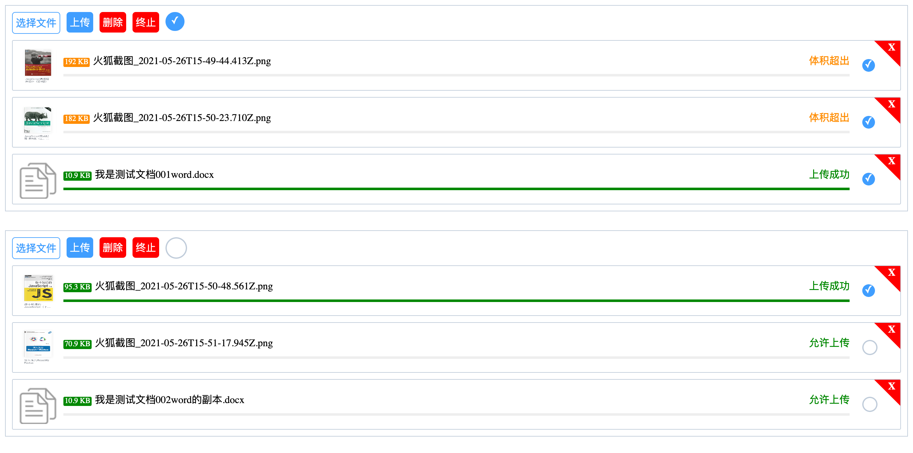

# easyUpload.js
**一款简单简单易用、可配置的H5文件上传插件。支持多文件上传、批量上传、混合上传，以及多实例上传。**

  

## 特性
- *文件类型可配置*
- *文件数量可配置*
- *文件大小可配置*
- *上传前文件可预览*
- *展示上传实时进度条*
- *批量上传*
- *支持不同类型文件混合上传*
- *支持自由配置 base64 或 FormData 等数据格式*
- *支持自由配置请求头等，api保持和原生api一致*
- *支持自由配置请求成功状态码*
- *css与结构分离，支持自由定制样式*
- *原生js编写，不依赖任何类库*

## 使用说明
1. html页面内引入easyUpload.js和easy_upload.css，简单配置后即可使用
2. 生产环境建议用product文件夹内压缩代码，开发测试建议beta文件夹内原生代码

## 配置说明
```js
// easyUpload(configs)
easyUpload({
   easyId: 'easy1',
   action: 'https://jsonplaceholder.typicode.com/posts/',
   maxSize: 0.5,
   setRequestHeader: function(xhr) {
       xhr.setRequestHeader('content-type', 'application/x-www-form-urlencoded');
   },
   buildSendData: function(file) {
       // var formData = new FormData(); // 发送格式为formData时
       // formData.append('name', file.file)
       // return formData;

       // return file.base64; //发送格式为base64时

       return null; //发送空数据，用于测试
   },
   checkSuccessCode: function(xhr) {
       if (/error/.test(xhr.responseText.toLowerCase())) { //这里判断仅仅用于测试，具体看项目
           return false;
       } else {
           return true;
       }
   }
});
```

## 参数说明
```js
// 以下为默认配置，重新配置后将覆盖
var defaultConfigs = {
  easyId: '', //插件插入节点的Id，String类型
  accept: '.jpg,.png,.pdf', //允许文件类型后缀名，逗号分隔，String类型
  action: '', //上传文件地址，String类型
  maxCount: 3, //最大文件数量，Number类型
  maxSize: 3, //最大文件尺寸，Number类型
  multiple: true, //是否开启多文件上传，Boolean类型
  messageTime: 2000, //messageBox消息提示毫秒数，Number类型
  responseType: 'text', //xhr的responseType格式，String类型
  showSize: true, //是否展示文件尺寸，Number类型
  timeout: 0, //请求超时毫秒数，0表示永久，Number类型
  withCredentials: true, //是否允许请求头自带cookie等证书，Boolean类型
  setRequestHeader: null, //配置xhr请求头的方法
  buildSendData: null, //配置xhr发送数据格式的方法，返回data
  checkSuccessCode: null //检查成功状态码的方法，返回布尔值
};
```

## 欢迎交流及支持
*qq: 1016981640*

<center class="half">
    
    
</center>